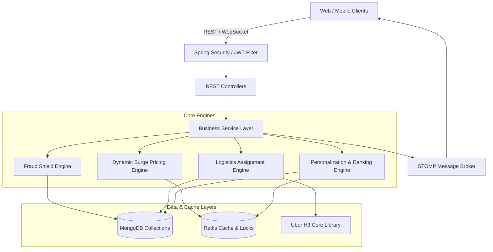

# Intelligent Food Delivery Platform (Backend Core)

An enterprise-grade, high-performance backend core for an Intelligent Food Delivery Platform built using **Spring Boot 3.2.4**, **MongoDB**, **Redis**, and the **Uber H3 Geospatial Indexing System**. 

The system implements 6 key business components:
1. **Fraud Detection & Order Validation System** (Velocity checking, cancellation patterns, coupon/refund abuse detection, ConcurrentHashMap checkout locking, and 500ms timeout SLA).
2. **Advanced Restaurant Search & Filtering System** (Geospatial `$geoNear` radius discovery and multi-parameter filters).
3. **Dynamic Surge Pricing System** (Real-time weather and traffic telemetry ingestion, EMA smoothing, and HMAC-signed quote tokens).
4. **Smart Delivery Partner Assignment System** (Geospatial candidate sweeps, weighted scoring matrices, and atomic lock state transitions).
5. **Real-Time Tracking & Notifications** (WebSockets, STOMP brokers, simulated FCM push clients, and notification lifecycles).
6. **Recommendation & Personalization Engine** (Personalized cuisine affinity vectors, hybrid content + collaborative ranking, and order attribution tracking).

---

## 1. Project Architecture Document

### High-Level Architecture Diagram


### Architectural Highlights & Design Patterns
* **Single-Node Lock Registry**: Implements transaction integrity and race-condition prevention during checkout using an in-memory `ConcurrentHashMap` key registry (`activeLocks`) inside the `FraudEvaluationService`. This ensures high throughput without external lock latency.
* **Geospatial Processing (H3 Core)**: Coordinates are mapped to H3 Resolution 8 hexagons. Candidate sweeps for driver dispatch start at a 3km radius, expanding to 5km and 8km dynamically.
* **Cache Stampede Protection (Mutex Locking)**: The dynamic surge calculation service incorporates a spin-wait mutex pattern (`lock:surge:h3:<H3_Cell>`) backing the cache-miss calculation block to protect databases against sudden traffic spikes.
* **Symmetric Token Verification**: Surge Pricing calculates quotes and signs the parameters (`cartId`, `restaurantId`, `h3Index`, `surgeMultiplier`, `deliveryFee`, `expiresAt`, `nonce`) using HMAC-SHA256. The checkout service recalculates and verifies the token signature before placing an order.

---

## 2. Environment Variables List

Create an `.env` file or configure your IDE run profile with the following variables:

| Variable | Default Value | Description |
| :--- | :--- | :--- |
| `SERVER_PORT` | `8082` | Spring Boot web server port (prevents conflicts with 8080). |
| `MONGODB_URI` | `mongodb://localhost:27017/food_delivery` | Connection URI for the MongoDB database. |
| `REDIS_HOST` | `localhost` | Redis server hostname. |
| `REDIS_PORT` | `6379` | Redis server port. |
| `REDIS_PASSWORD` | *(Empty)* | Redis server authentication password. |
| `SURGE_TOKEN_SECRET`| `default-surge-token-shared-secret-key-32-bytes-long` | Cryptographic secret for signing surge pricing tokens. |
| `JWT_SECRET` | `default-secret-key-change-in-production-must-be-at-least-256-bits-long-for-hs256` | Secret for signing JWT authentication tokens. |
| `JWT_EXPIRATION` | `86400000` | JWT token validity in milliseconds (24 hours). |
| `ADMIN_EMAIL` | `admin@fooddelivery.com` | Primary admin bootstrap email. |
| `ADMIN_PASSWORD` | `Admin@123` | Primary admin bootstrap password. |
| `ADMIN_NAME` | `System Admin` | Primary admin profile name. |

---

## 3. MongoDB Collections List

The MongoDB instance structures collections as follows:

1. **`users`**: Contains account profiles (name, email, hashed password, phone, role: `USER`, `DELIVERY_PARTNER`, `ADMIN`).
2. **`restaurants`**: Stores restaurant configurations, coordinates (GeoJSON Point), status (`isActive`, `isVerified`), cuisines, price ranges, ratings, and H3 cell indexes.
3. **`orders`**: Captures order items, snapshot pricing, status (`CREATED`, `RESTAURANT_ACCEPTED`, `PREPARING`, `READY_FOR_PICKUP`, `OUT_FOR_DELIVERY`, `DELIVERED`, `CANCELLED`, `REJECTED`), payment status, fraud shield checks, and status histories.
4. **`deliveryPartners`**: Active delivery profiles containing status (`ONLINE`, `BUSY`, `OFFLINE`, `SUSPENDED`), current coordinates, acceptance rates, ratings, and current order assignments.
5. **`notifications`**: History of push messages dispatched to users with status (`UNREAD`, `READ`).
6. **`recommendationEvents`**: Logs click-through telemetry (discover events, click logs, and order conversion attributions).
7. **`userRecommendationProfiles`**: Real-time user taste profiling, storing cuisine affinity vectors and loyalty scores.
8. **`dailyFraudMetrics`**: Aggregated audit totals for velocity monitoring and block/restriction statistics.
9. **`dailySurgeSummaries`**: Stores rolling average surge multipliers and peak values per H3 cell index.
10. **`surgeRules`**: zone configurations defining base thresholds, scales, and maximum multipliers.
11. **`surgeOverrides`**: Active administrator override policies for specific H3 hex zones.

---

## 4. Redis Keys Documentation

| Redis Key Pattern | Type | TTL | Description |
| :--- | :--- | :--- | :--- |
| `surge:weather:<H3_Cell>` | `String` | 10 Min | Cached weather factor telemetry for zone. |
| `surge:traffic:<H3_Cell>` | `String` | 10 Min | Cached traffic factor telemetry for zone. |
| `surge:h3:<H3_Cell>` | `String` | 60 Sec | Current active surge multiplier for checkout. |
| `surge:last_calculated:<H3_Cell>`| `String` | 5 Min | Last calculated raw multiplier for EMA smoothing. |
| `surge:override:<H3_Cell>` | `String` | Dynamic | Dynamic admin surge override values. |
| `surge:emergency:disabled` | `String` | None | Flag indicates the global surge switch is killed. |
| `lock:surge:h3:<H3_Cell>` | `String` | 5 Sec | Spin-wait mutex lock protecting against cache stampedes. |
| `token:used:<Nonce>` | `String` | Dynamic | Nonce blacklist to prevent replay attacks during checkout. |
| `set:drivers:h3_res8:<H3_Cell>` | `Set` | None | Set of ONLINE driver user IDs inside H3 hexagon cell. |
| `zset:checkouts:<H3_Cell>` | `ZSet` | 10 Min | Checkout timestamps utilized in pressure indices. |
| `cf:user:<UserId>:candidates` | `List` | None | Collaborative recommendations precomputed candidates. |

---

## 5. API Documentation Summary

### Authentication APIs
* **`POST /api/auth/register`**: Registers a new customer or driver.
* **`POST /api/auth/login`**: Authenticates user and returns JWT Bearer Token.
* **`GET /api/auth/me`**: Retrieves details of the authenticated context.

### Restaurant Search APIs
* **`GET /api/restaurants/nearby`**: Fetches active, verified restaurants within a radius.
  * Parameters: `latitude` (Double), `longitude` (Double), `radiusKm` (Double).
* **`POST /api/search`**: Advanced multi-attribute search and filtering.
  * Filters: cuisines, price ranges, vegetarian, open now, rating thresholds.

### Surge Pricing APIs
* **`POST /api/pricing/quote`**: Computes dynamic surge delivery quote and signs token.
  * Parameters: `cartId`, `restaurantId`, `deliveryLatitude`, `deliveryLongitude`.
* **`POST /api/admin/surge/overrides`**: Creates a manual multiplier override.
* **`POST /api/admin/surge/emergency-disable`**: Systems-wide emergency killswitch configuration.

### Checkout & Fraud Shield APIs
* **`POST /api/orders`**: Submits a checkout order verifying idempotency keys and quote tokens.
* **`GET /api/orders/{id}`**: Fetches details for a specific order.
* **`PATCH /api/vendor/orders/{id}/status`**: Advances order status states.
* **`PATCH /api/admin/orders/{id}/fraud-review`**: Admin review/approval of flag-held orders.

### Driver Logistics APIs
* **`PATCH /api/delivery/availability`**: Sets status (`ONLINE`, `OFFLINE`).
* **`POST /api/delivery/location`**: Submits active GPS coordinate telemetry.
* **`POST /api/delivery/orders/{orderId}/accept`**: Driver accepts a matched offer.

### Notifications & Personalization APIs
* **`GET /api/notifications`**: Retrieves user notification history.
* **`PATCH /api/notifications/read-all`**: Marks all notifications as read.
* **`POST /api/recommendations/discover`**: Returns recommended restaurants based on affinities.
* **`POST /api/recommendations/event/click`**: Logs Click-Through Event for CTR telemetry.

---

## 6. Installation Guide

### Prerequisites
1. **Java Development Kit (JDK)**: Version 17 or higher (tested on Java 25).
2. **Apache Maven**: Version 3.8+.
3. **MongoDB**: Local community server running on port `27017`.
4. **Redis**: Local memory cache running on port `6379`.

---

## 7. Run Instructions

### Step 1: Start MongoDB and Redis
Ensure your local databases are active. In Windows PowerShell:
```powershell
# Verify MongoDB is running
Get-Service -Name MongoDB

# Run Redis server (using your local installation path)
& "C:\Program Files\Redis\redis-server.exe"
```

### Step 2: Start Spring Boot
Compile and launch the Spring Boot application using Maven:
```powershell
cd food-delivery-backend
$env:SERVER_PORT="8082"
mvn spring-boot:run
```

---

## 8. Admin Credentials Section

The system automatically bootstraps an administrator account on startup:

* **Email**: `admin@fooddelivery.com`
* **Password**: `Admin@123`
* **Role**: `ADMIN`

Use these credentials to retrieve the JWT Bearer token for accessing admin and vendor-protected endpoints.

---

## 9. Sample Test Data Seeder

Connect to your MongoDB instance using `mongosh` or MongoDB Compass and execute the following scripts to seed the baseline restaurant, driver, and zone configurations:

```javascript
use food_delivery;

// 1. Seed Restaurant (Pizza Palace)
db.restaurants.insertOne({
  "_id": "6a3673558e02e33fdf59412c",
  "name": "Pizza Palace",
  "cuisines": ["pizza", "italian"],
  "priceRange": 2,
  "averageRating": 4.5,
  "totalRatings": 150,
  "popularityScore": 92.5,
  "averageDeliveryTimeMinutes": 30,
  "location": {
    "type": "Point",
    "coordinates": [77.5946, 12.9716]
  },
  "h3Index": "8860145b49fffff",
  "isActive": true,
  "isVerified": true,
  "isDeleted": false,
  "createdAt": ISODate(),
  "updatedAt": ISODate()
});

// 2. Seed Default Surge Pricing Rule
db.surgeRules.insertOne({
  "zoneName": "GLOBAL_DEFAULT",
  "baseMultiplier": 1.0,
  "thresholdSurge": 0.3,
  "scaleFactor": 1.5,
  "maxMultiplier": 2.5,
  "createdAt": ISODate()
});
```

---

## 10. Swagger Usage Guide

Once the Spring Boot application starts, the Swagger OpenAPI endpoints are fully accessible:

* **Swagger UI Interactive Panel**: [http://localhost:8082/swagger-ui/index.html](http://localhost:8082/swagger-ui/index.html)
* **OpenAPI Raw JSON Documentation**: [http://localhost:8082/v3/api-docs](http://localhost:8082/v3/api-docs)

To test secure APIs inside the Swagger UI, click **Authorize** in the top right and enter the Bearer JWT token returned from the Login endpoint:
`Bearer <your_retrieved_jwt_token>`

---

## 11. Postman Collection Checklist

Configure your Postman requests sequentially to execute the full end-to-end integration checklist:

1. **[Authentication]** Login as Admin using the bootstrap credentials and capture the token.
2. **[Search]** Call `GET /api/restaurants/nearby` with coordinates `(12.9716, 77.5946)` and verify that "Pizza Palace" is discovered.
3. **[Pricing]** Call `POST /api/pricing/quote` with `cartId: <admin_user_id>` to generate an HMAC signature token.
4. **[Checkout]** Call `POST /api/orders` passing the retrieved `quoteToken` and `surgeMultiplier`. The order is saved with status `CREATED`.
5. **[Logistics Setup]** Call `PATCH /api/delivery/availability` (body: `{"status": "ONLINE"}`) and `POST /api/delivery/location` (body: coordinates matching restaurant) using the driver context.
6. **[Dispatch]** Call `PATCH /api/vendor/orders/{orderId}/status` advancing status to `RESTAURANT_ACCEPTED`, `PREPARING`, and finally `READY_FOR_PICKUP`. Verify that the driver auto-matches and assigns.
7. **[Notifications]** Call `GET /api/notifications` to fetch order lifecycle alerts.
8. **[Recommendations]** Call `POST /api/recommendations/discover` with coordinate signals and verify Pizza Palace ranks first with explanations.
